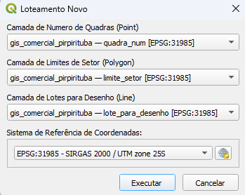

# Plugin Lotear CGP para QGIS

Este é um plugin para o QGIS que facilita a criação de loteamentos seguindo os padrões da **CAGEPA (Companhia de Água e Esgotos da Paraíba)**. O plugin foi desenvolvido em Python e pode ser instalado diretamente no QGIS.

## Funcionalidades

- Criação automática de lotes e quadras a partir de um modelo pré-definido.
- Conformidade com os padrões técnicos da CAGEPA.
- Personalizado de acordo com o projeto feito no MODEL BUILDER, para atender às necessidades específicas do projeto.

## Tela do plugin



## Como Instalar

1. Adicione o repositório do plugin no QGIS:
   - Vá para **"Plugins"** > **"Gerenciar e Instalar complementos..."**.
   - Na aba **"Opções"** > **"Repositórios de Complementos"** > **"Adicionar..."** e adicione o repositório com o link:
     ```
     Nome: Lotear CGP
     URL: https://raw.githubusercontent.com/hfrade94/Lotear-CGP/refs/heads/main/plugins.xml
     ```
2. Instale o plugin:
   - Pesquise por **"Lotear CGP"** na lista de plugins.
   - Clique em **"Instalar Plugin"**.

## Como Usar

1. Após a instalação, o plugin estará disponível na barra de ferramentas do QGIS.
2. Clique no ícone do plugin para abrir a interface.
3. Selecione as camadas e o sistema de referência, de acordo com as descrições de cada menu da interface do plugin.
4. Ao clicar em **"Executar"** o plugin cria 3 camadas temporarias: cod_lote, quadras, lotes, contendo os campos com os dados para cadastro de nova inscrição dos imóveis.

## Requisitos

- QGIS 3.40
- Python 3.12
# LotearCGP
